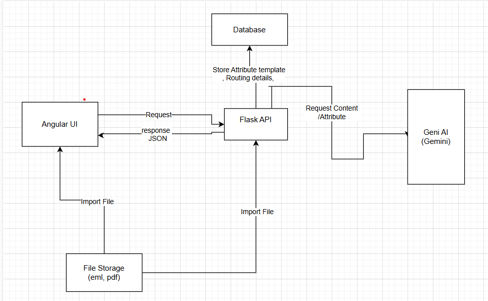

# 🚀 Project Name


## 📌 Table of Contents
- [Introduction](#introduction)
- [Demo](#demo)
- [Inspiration](#inspiration)
- [What It Does](#what-it-does)
- [How We Built It](#how-we-built-it)
- [Challenges We Faced](#challenges-we-faced)
- [How to Run](#how-to-run)
- [Tech Stack](#tech-stack)
- [Team](#team)

---

## 🎯 Introduction
The Gen AI Orchestrator for Email and Document Triage/Routing is an intelligent system designed to streamline the processing and routing of emails and documents. By leveraging Generative AI, this solution automates the extraction of key information (e.g., amounts, coordinates, addresses) from emails and documents, enabling efficient triage and routing to the appropriate workflows or teams.

This project addresses the challenge of manually processing large volumes of unstructured data in emails and documents, which is time-consuming and prone to errors. With the power of AI, it ensures faster decision-making, improved accuracy, and enhanced productivity in handling critical business communications.

## 🎥 Demo
🔗 [Live Demo](#) (if applicable)  
📹 [Video Demo](#) (if applicable)  
🖼️ Screenshots:




## 💡 Inspiration
The Gen AI Orchestrator for Email and Document Triage/Routing was inspired by the growing challenge of managing large volumes of unstructured data in emails and documents. Organizations often face delays and inefficiencies when manually processing and routing critical information, leading to missed opportunities and errors.

## ⚙️ What It Does
This project aims to solve these challenges by leveraging Generative AI to automate the extraction of key information (e.g., amounts, coordinates, addresses) and streamline the routing process. The inspiration came from the need to improve productivity, reduce human error, and enable faster decision-making in handling business communications. By automating these tasks, the solution empowers teams to focus on higher-value activities and ensures seamless workflows.

## 🛠️ How We Built It
he Gen AI Orchestrator for Email and Document Triage/Routing was developed using the following technologies, frameworks, and tools:

Frontend
Angular: For building the user interface, enabling users to upload .eml files and input additional attributes.
HTML/CSS: For designing and styling the UI components.
Bootstrap: For responsive and user-friendly design.

Backend
Flask (Python): For handling API requests, processing .eml files, and integrating with the AI model.
Python: For implementing logic to extract key information (e.g., amounts, coordinates, addresses) from emails and documents.

AI Integration
Google Generative AI (Gemini Model): For processing extracted data and generating insights or routing decisions.

Database
SQLite: For storing metadata, extracted attributes, and routing history (optional).

File Handling
Python email Library: For parsing .eml files and extracting email content.

File Storage: For temporarily storing uploaded .eml files.

Development Tools
Visual Studio Code: For code development and debugging.
Postman: For testing API endpoints.
Git: For version control and collaboration.
Draw.io: For creating architecture diagrams.

## 🚧 Challenges We Faced
Balancing feature development, testing, and deployment within a limited timeframe posed a challenge, requiring prioritization of core functionalities.

## 🏃 How to Run
1. Clone the repository  
   ```sh
   git clone https://github.com/ewfx/gaied-edoccoder/tree/main

   Navigate to "code/UI" path for running Ui

   ```
2. Install dependencies  
   ```sh
   npm install  # or pip install -r requirements.txt (for Python)
   ```
3. Run the project  
   ```sh
   npm start  # or python app.py
   ```
   avigate to "code/API" path for running API

   ```
2. Install dependencies  
   ```sh
   pip install -r requirements.txt (for Python)
   ```
3. Run the project  
   ```sh
   python app.py
   ```

## 🏗️ Tech Stack
- 🔹 Frontend:  Angular
- 🔹 Backend: Flask Python
- 🔹 Other: OpenAI API (Gemini)

## 👥 Team
- **Your Name** - [GitHub](#) | [LinkedIn](#)
- **Teammate 2** - [GitHub](#) | [LinkedIn](#)